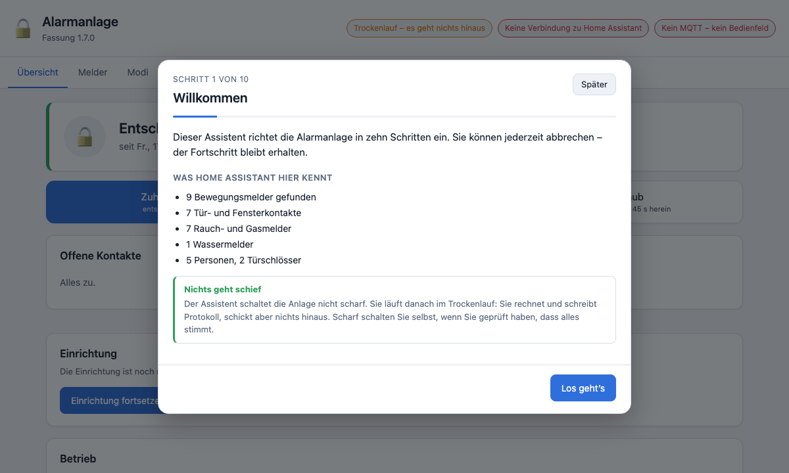
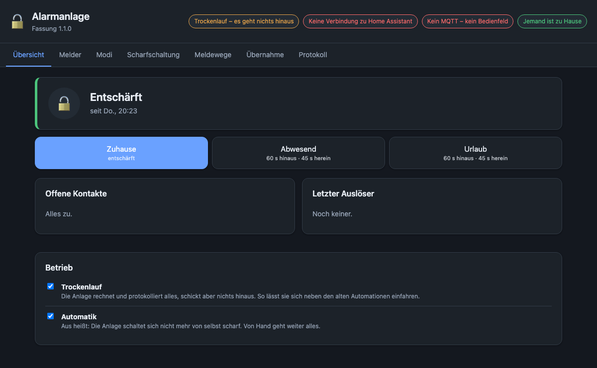
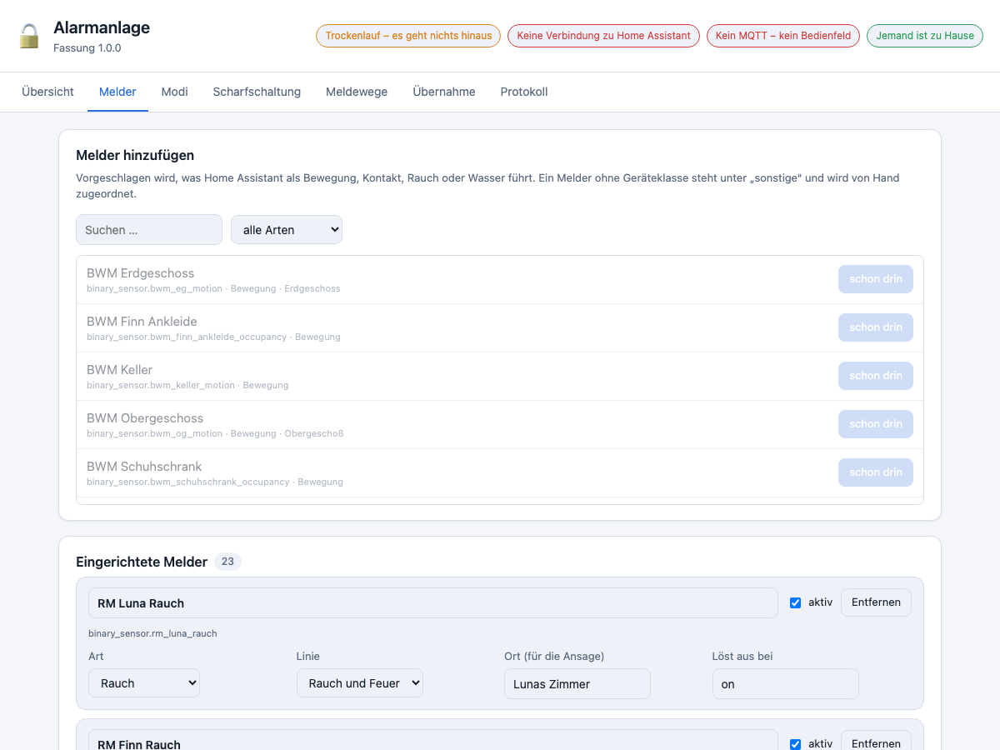
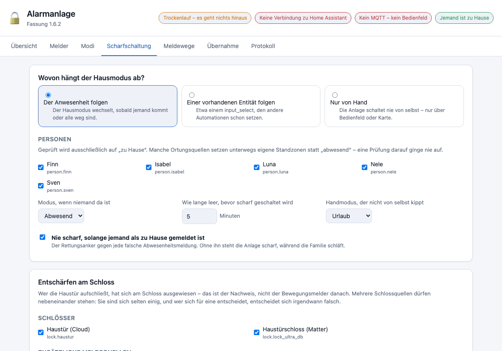
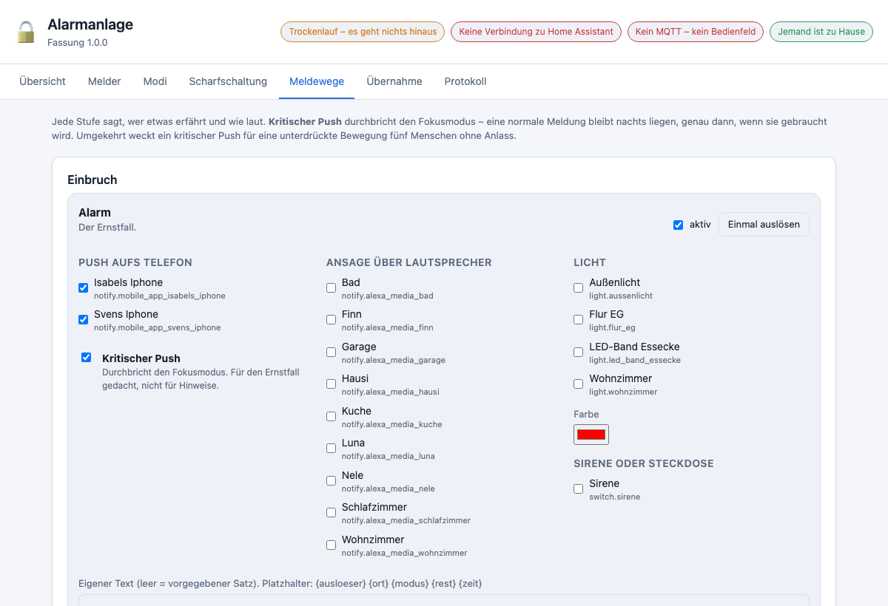

# Handbuch – Alarmanlagen-Manager

Für Home Assistant. Stand: Fassung 1.8.0.

---

## Inhalt

1. [Was dieses Add-on ist, und was nicht](#was-dieses-add-on-ist-und-was-nicht)
2. [Vier Begriffe, die man auseinanderhalten muss](#vier-begriffe-die-man-auseinanderhalten-muss)
3. [Der Einrichtungsassistent](#der-einrichtungsassistent)
4. [Einrichten](#einrichten)
5. [Von vorhandenen Automationen kommen](#von-vorhandenen-automationen-kommen)
6. [Die Oberfläche, Seite für Seite](#die-oberfläche-seite-für-seite)
7. [Der Trockenlauf und das Umschalten](#der-trockenlauf-und-das-umschalten)
8. [Was in Home Assistant entsteht](#was-in-home-assistant-entsteht)
9. [Die Dashboard-Karte](#die-dashboard-karte)
10. [Wiederkehrende Aufgaben](#wiederkehrende-aufgaben)
11. [Wenn etwas nicht stimmt](#wenn-etwas-nicht-stimmt)
12. [Sicherung, Umzug, Zurückdrehen](#sicherung-umzug-zurückdrehen)
13. [Grenzen](#grenzen)

---

## Was dieses Add-on ist, und was nicht

Es ist eine **Einbruch- und Gefahrenmeldeanlage**, die vollständig über eine
Oberfläche eingerichtet wird. Melder, Scharfmodi, Verzögerungen,
Scharfschaltung, Meldewege und Protokoll stehen an einer Stelle statt verteilt
über `configuration.yaml`, ein Dutzend Automationen und eine Handvoll Helfer.

Es ist **keine zertifizierte Einbruchmeldeanlage**. Es hängt an WLAN, Zigbee,
womöglich an einer Cloud und in jedem Fall am Strom im Haus. Wer eine
VdS-Anlage braucht, braucht eine VdS-Anlage.

Und es **fährt keine Rollos**. Wer bei Rauch den Fluchtweg öffnen will, macht
das dort, wo die Rollos gesteuert werden. Zwei Stellen, die bei Rauch Rollos
fahren, fahren irgendwann gegeneinander.

---

## Vier Begriffe, die man auseinanderhalten muss

Das ist der wichtigste Abschnitt des Handbuchs. Wer diese vier Dinge
vermischt, baut sich dieselben Fallen ein, die eine gewachsene
Automations-Alarmanlage über die Jahre ansammelt.

| Begriff | Was er bedeutet |
|---|---|
| **Hausmodus** | Was gelten *soll*: Zuhause, Abwesend, Urlaub, Nacht |
| **Panel-Zustand** | Was die Anlage gerade *tut*: entschärft, schaltet scharf, scharf, Eintrittsverzögerung, ausgelöst |
| **Linie** | Eine Gefahrenart: Einbruch, Rauch, Wasser – jede mit eigenen Meldewegen |
| **Melder** | Eine Entität mit Art, Linie, Modi und Verzögerung |

### Warum Hausmodus und Panel zwei Dinge sind

Sie laufen absichtlich auseinander. Schließt jemand die Haustür auf,
**entschärft** die Anlage – der Hausmodus bleibt aber **„Abwesend"**, und die
Anlage kommt nach der Sperrfrist von selbst zurück in den scharfen Zustand.

Presste man beides in eine Größe, bräuchte man für genau diesen Fall wieder
einen Kunstgriff. Und den nächsten für den Fall, dass jemand mittags zum
Fischefüttern kommt und abends nicht wieder scharf geschaltet wird.

### Warum Linien zwei Geltungen haben

* **Nur wenn scharf** (Einbruch): Melder zählen, wenn die Anlage scharf ist.
* **Rund um die Uhr** (Rauch, Wasser): Melder zählen immer.

Auf der Rauchlinie liegen vier Arten: **Rauch**, **Gas**, **Kohlenmonoxid**
und **Hitze**. Sie werden gleich gemeldet, sind aber nicht dieselbe Gefahr –
Kohlenmonoxid ist geruchlos, unsichtbar und brennt nicht. Der vorgegebene
Meldetext richtet sich deshalb nach der Art des Melders, nicht nach der
Linie: „Achtung! Wohnzimmer meldet Kohlenmonoxid.“

Rauch kümmert es nicht, ob jemand zu Hause ist. Und wer die Einbruchanlage
entschärft, hat damit nicht das Feuer gelöscht. Die Dauerlinien rühren den
Panel-Zustand deshalb **nicht** an – sie melden über eigene Sensoren.

---

## Der Einrichtungsassistent



Beim ersten Start führt ein Assistent durch zehn Schritte. Er ist später
über **Übersicht → Einrichtung** wieder erreichbar und ändert nur, was Sie
bestätigen.

| Schritt | Worum es geht |
|---|---|
| 1 | Was Home Assistant hier kennt, in Zahlen |
| 2 | Vorhandene Automationen erkennen und ihre Einstellungen übernehmen |
| 3 | Personen – woran die Anlage Anwesenheit erkennt |
| 4 | Melder, nach Art gruppiert und sinnvoll vorausgewählt |
| 5 | Haustiere – welche Räume das Tier darf |
| 6 | Türschlösser – der Ausweis beim Heimkommen |
| 7 | Ausgeh- und Eintrittsverzögerung |
| 8 | Meldewege – Push, Ansagen bei Rauch |
| 9 | Eine harmlose Testmeldung |
| 10 | Zusammenfassung und der Weg in den Echtbetrieb |

**Auch eine eingerichtete Anlage darf hindurch.** Der Assistent zeigt dann
überall, was schon eingestellt ist – die gewählten Personen, die
eingerichteten Melder, die Haustier-Räume, die Zeiten und die Meldewege. Wer
einmal durchklickt, ohne etwas zu ändern, ändert nichts. Melder, die Home
Assistant gerade nicht kennt, stehen mit dem Zusatz *(nicht gefunden)* in
der Liste und bleiben erhalten.

Die einzige Ausnahme ist Schritt 2: Ein erneutes Übernehmen aus den
Automationen **ersetzt** die Einstellungen. Der Schritt sagt das und fragt
vorher nach.

Zwei Dinge, auf die Sie sich verlassen können:

* **Der Assistent schaltet nie scharf** und schaltet den Trockenlauf nicht
  ab. Am Ende läuft die Anlage im Probebetrieb, und Sie entscheiden, wann
  sie ernst macht.
* **Jeder Schritt speichert sofort.** Schließen Sie ihn mit *Später*, machen
  Sie beim nächsten Mal dort weiter, wo Sie aufgehört haben.

Überspringen geht bei jedem Schritt außer dem ersten und dem letzten. Was
Sie überspringen, behält seine Vorgabe und lässt sich in den Reitern
nachholen.

Wer die Anlage lieber von Hand einrichtet, klickt den Assistenten mit
*Später* weg – die folgenden Abschnitte beschreiben denselben Weg
ausführlich.

## Einrichten

### Voraussetzungen

* Home Assistant mit Supervisor (HAOS oder Supervised)
* Ein **MQTT-Broker**. Ohne ihn entsteht kein Bedienfeld in Home Assistant –
  das Mosquitto-Add-on genügt, der Supervisor meldet es von selbst
* Melder, die Home Assistant schon kennt (Bewegung, Kontakte, Rauch, Wasser)

### Installation

1. **Einstellungen → Add-ons → Add-on-Store → ⋮ → Repositories**, dort
   `https://github.com/Melle79/HA-alarmanlage` eintragen
2. *Alarmanlagen-Manager* installieren und starten
3. Die Oberfläche über den Eintrag **Alarmanlage** in der Seitenleiste öffnen

Beim ersten Start öffnet sich der [Einrichtungsassistent](#der-einrichtungsassistent)
von selbst. Und der **Trockenlauf ist an**. Die Anlage rechnet und
protokolliert alles, schickt aber nichts hinaus. Das ist Absicht: So lässt sie
sich neben einer vorhandenen Lösung einfahren, ohne dass nachts zwei Anlagen
melden.

### Optionen des Add-ons

| Option | Bedeutung |
|---|---|
| `mqtt_enabled` | MQTT benutzen |
| `mqtt_host`, `mqtt_port`, `mqtt_user`, `mqtt_password` | Nur nötig für einen Broker außerhalb von Home Assistant |
| `entity_praefix` | Erster Teil der Entitäts-IDs (Vorgabe `alarmanlage`) |
| `log_level` | `debug` zeigt jede Melderauswertung |

> **`entity_praefix` nach der ersten Einrichtung nicht mehr ändern.** Alle
> Entitäten bekämen neue IDs, und jede Automation, jede Karte und jeder
> Sprachbefehl liefe stillschweigend ins Leere.

---

## Von vorhandenen Automationen kommen

Das ist der übliche Weg. Es gibt dafür eine eigene Seite.

### 1. Durchsehen

**Übernahme → Automationen durchsehen.** Das Add-on liest
`automations.yaml` und erkennt, was zur Alarmanlage gehört – über die
benutzten Dienste (`alarm_control_panel.*`), über die Auslöser (hängt die
Automation an einem Rauchmelder?) und über den Namen.

Daraus baut es einen vollständigen Vorschlag:

* **Melder** mit Linie und Ort. Der Ort kommt aus dem Bereich in Home
  Assistant, nicht aus dem Meldernamen – „RM Luna Rauch" liest sich schlecht
  vor, „Lunas Zimmer" nicht
* **Personen** aus den Anwesenheitsprüfungen
* **Schlösser** aus den Entschärf-Automationen
* **Meldewege**: Push-Ziele aus den `notify.mobile_app_*`-Aufrufen,
  Lautsprecher aus den `notify.alexa_media_*`-Aufrufen
* **Verzögerungen** aus einem vorhandenen `manual`-Bedienfeld in
  `configuration.yaml`, damit die Übernahme nichts stillschweigend verschärft

Automationen, die zwar auf einen Melder hören, aber etwas anderes **tun** –
etwa Rollos fahren –, werden angezeigt, aber **nicht** vorgeschlagen. Sie
gehören woandershin.

### 2. Übernehmen

Der Knopf *Übernehmen* spielt den Vorschlag ein. Die Anlage läuft weiter im
Trockenlauf.

Jetzt nachjustieren: **Melder**, **Modi**, **Scharfschaltung**,
**Meldewege**. Alles wird sofort gespeichert; es gibt keinen
Speichern-Knopf, den man vergessen könnte.

### 3. Ein paar Tage mitlaufen lassen

Ins **Protokoll** sehen. Dort steht, was die Anlage getan *hätte*. Stimmt es
mit dem überein, was die alten Automationen getan haben, ist der Umbau
belastbar.

### 4. Umschalten

1. **Trockenlauf aus** (Übersicht → Betrieb)
2. **Übernahme → Alte Automationen abschalten**

Sie werden **abgeschaltet, nicht gelöscht**. Ihr Zustand liegt vorher
gesichert unter `/data/sicherungen/`. Der Knopf *Wieder einschalten* dreht
beides zurück: Automationen an, Trockenlauf an.

### 5. Aufräumen – erst danach

Erst wenn die Anlage ein paar Tage allein gelaufen ist, können weg:

* der `alarm_control_panel:`-Block aus `configuration.yaml`
* `input_select.hausmodus` und die übrigen Helfer der alten Lösung

Vorher nicht. Solange die alten Automationen nur *abgeschaltet* sind, brauchen
sie ihre Helfer noch, falls man zurückdreht.

---

## Die Oberfläche, Seite für Seite

### Übersicht



Die große Kachel zeigt den Panel-Zustand, seit wann er gilt und – bei
laufender Verzögerung – wie lange noch. Darunter der Hausmodus als
Knopfreihe; ein Klick setzt ihn.

Die Marken oben sind das, was man wissen muss, bevor man sich auf die Anlage
verlässt: **Trockenlauf**, **Automatik aus**, **keine Verbindung zu Home
Assistant**, **kein MQTT**, **Nachlaufsperre aktiv**, **jemand ist zu Hause**.

Unten zwei Schalter:

* **Trockenlauf** – die Anlage rechnet, meldet aber nichts nach außen
* **Automatik** – aus heißt: Sie schaltet sich nicht mehr von selbst scharf.
  Von Hand geht weiter alles

### Melder



Melder stehen **nach Linie gruppiert** und darin **nach Bereich sortiert**.
Jeder ist eine Zeile, die zugeklappt sagt, was man beim Durchsehen wissen
will: Name, Bereich, Art, in welchen Modi er gilt, ob er verzögert auslöst.

Der **Punkt links** zeigt den Zustand:

| | |
|---|---|
| ⚪ grau | ruhig |
| 🟡 gelb | spricht gerade an |
| 🔴 roter Ring | diese Entität gibt es in Home Assistant nicht mehr |

Beim Einrichten läuft man einmal durchs Haus und sieht zu.

#### Was ein Melder einstellt

| Feld | Bedeutung |
|---|---|
Aufgeklappt stehen die Felder in vier Abschnitten, in derselben
Reihenfolge wie hier.

**Was er ist**

| Feld | Bedeutung |
|---|---|
| **Name** | Nur die Anzeige |
| **Art** | Bewegung, Kontakt, Erschütterung, Rauch, Gas, Kohlenmonoxid, Hitze, Wasser |
| **Linie** | Auf welche Gefahrenlinie er gehört |
| **Ort** | Wird vorgelesen. „Lunas Zimmer", nicht „RM Luna Rauch" |
| **Löst aus bei** | Der Zustand, der als Auslösung gilt (fast immer `on`) |

**Wann er zählt**

| Feld | Bedeutung |
|---|---|
| **In diesen Modi** | In welchen Scharfmodi er gilt. Nichts angehakt = alle |
| **Eintrittsverzögerung** | Aus heißt: löst sofort aus, ohne Zeit zum Entschärfen |

**Gegen Fehlalarme**

| Feld | Bedeutung |
|---|---|
| **Mindestdauer** | Sekunden, die er anhalten muss, bevor er zählt |
| **Ruhequelle** | Entitäten, deren Bewegung ihn erklärbar auslöst |
| **Ruhezeit** | Wie lange er danach übergangen wird |

**Was gemeldet wird**

| Feld | Bedeutung |
|---|---|
| **Eigener Meldetext** | Überschreibt den Satz der Linie für genau diesen Melder |

Dazu im Fuß: **Dieser Melder zählt** – abschalten, ohne zu löschen.

> **„Gilt in: alle angehakt" wird als leere Liste gespeichert.** Das ist keine
> Kosmetik: Kommt später ein Modus dazu, gilt der Melder dann auch dort,
> statt stillschweigend zu fehlen.

#### Der eigene Meldetext

Eine Linie umfasst mehr als eine Gefahr. Auf der Rauchlinie hängt auch der
**Kohlenmonoxidmelder** – dieselbe Gefahr, dieselben Meldewege –, aber
„Achtung! Wohnzimmer meldet Rauch" wäre dort falsch. Wer nachts von einem
kritischen Push geweckt wird, soll erfahren, wonach er sucht.

Der Satz gilt für den **Alarm**, nicht für die Entwarnung: „Achtung,
Kohlenmonoxid!" taugt nicht als Meldung, dass nichts mehr anliegt.

Im Feld steht blass, was ohne ihn gesagt würde.

#### Haustiere

Ein Hund oder eine Katze, die während der Abwesenheit im Haus bleiben,
laufen an jedem Bewegungsmelder vorbei, den sie erreichen. Dagegen hilft
keine Empfindlichkeitseinstellung, sondern eine Entscheidung: **Welche
Räume darf das Tier, und welche Melder gelten dort nicht?**

Drei Wege, vom feinsten zum gröbsten:

* **Melder nur in bestimmten Modi** – der Wohnzimmermelder gilt nur im
  Urlaub, weil der Hund dann nicht im Haus ist. Der Raum bleibt bewacht,
  wenn er leer ist.
* **Melder abschalten** – „Dieser Melder zählt" aus. Der Raum ist dann
  unbewacht, der Weg dorthin aber weiterhin.
* **Mindestdauer** – hilft nur, wenn das Tier kurz vorbeiläuft und ein
  Mensch länger bliebe. Bei Präsenzmeldern mit Haltezeit taugt das nicht.

Welche Melder betroffen sind, sagt die Historie besser als das Gefühl:
Wer im Verlauf von Home Assistant die Zeiten der Abwesenheit mit den
Melderausschlägen vergleicht, sieht sofort, wie weit das Tier kommt.

#### Zwei Werkzeuge gegen Fehlalarme

Sie lösen verschiedene Probleme und sind deshalb getrennt.

**Mindestdauer** – der Melder muss so lange anhalten, bevor er zählt. Gegen
kurze Zucker unbekannter Ursache. Fällt er vorher ab, fängt die Messung
beim nächsten Mal von vorn an.

> **Vorsicht bei Präsenzmeldern.** Viele halten von sich aus rund 60
> Sekunden. Dort trennt die Mindestdauer echte von falschen Auslösungen
> nicht – beide sehen gleich lang aus. Vor dem Einstellen im Verlauf
> nachsehen, wie lange die Auslösungen tatsächlich dauern.

**Ruhequelle** – Entitäten, deren Bewegung diesen Melder erklärbar auslöst.
Nach einer Änderung an einer solchen Entität wird der Melder für die
Ruhezeit übergangen, mit Eintrag im Protokoll.

Der Anlass war ein Präsenzmelder im Büro, der vier Morgen hintereinander um
08:30 ansprang – immer genau vier Sekunden, nachdem der Rollladen im selben
Zimmer auffuhr. Das ist keine Unzuverlässigkeit des Melders, sondern eine
bekannte Ursache. Und gegen eine bekannte Ursache hilft kein Zeitfilter,
sondern Wissen: Rollladen als Ruhequelle eintragen, fertig.

Wer so etwas sucht, vergleicht im Verlauf von Home Assistant die Uhrzeiten
des Melders mit denen der Rollläden, Lüfter, Heizung oder Saugroboter. Ein
immer gleicher Abstand ist der Beweis.

#### Was fehlt

Je Linie steht, **welche passenden Melder Home Assistant kennt, die hier nicht
eingerichtet sind** – mit einem Knopf, der sie alle übernimmt. Ein
Rauchmelder, der in keiner Alarmanlage steht, fällt sonst niemandem auf.

Drei Knöpfe stehen daran: *Alle hinzufügen*, *Einzeln ansehen* und **Nicht
mehr anbieten**. Der dritte ist öfter der richtige, als man denkt – ein
Präsenzmelder, der zu oft falsch meldet, oder ein Gerät, das gar nicht
angeschlossen ist. Wer den Hinweis jedes Mal wegschaut, hört irgendwann auf
hinzusehen, und dann verpasst er den Rauchmelder, der wirklich fehlt.

Der Vorschlag geht nämlich nach der Geräteklasse, und die ist gutgläubig: In
einer gewachsenen Installation tragen auch Dinge die Klasse *opening*, die
mit dem Haus nichts zu tun haben – etwa der Öffnungszustand von Tankstellen.

*Einzeln ansehen* öffnet die Liste und zeigt darin **nur die Melder aus
diesem Hinweis**. Ein Knopf *Weitere für diese Linie* geht eine Ebene
weiter: alles, was zu dieser Gefahrenlinie passt. Für den Einbruch sind das
Bewegung, Kontakte und Erschütterung – keine Rauchmelder. Denselben Blick
gibt es über dem Suchfeld als Filter *für Einbruch*, *für Rauch*, *für
Wasser*.

Ausgeblendetes kommt zurück über *Melder hinzufügen*: dort steht der
Schalter **N ausgeblendet anzeigen** (mit ↩ je Eintrag) und der Knopf **Alle
wieder anbieten**.

Die eigenen Sammelsensoren des Add-ons stehen gar nicht erst zur Auswahl –
sonst würde der Sammelsensor zum Melder für sich selbst.

### Modi

Je Modus zwei Zeiten:

* **Ausgehverzögerung** – Zeit zum Verlassen des Hauses, bevor die Melder
  zählen. Während sie läuft, löst kein Melder aus; man geht ja an seinem
  eigenen Bewegungsmelder vorbei
* **Eintrittsverzögerung** – Zeit zum Entschärfen, bevor der Alarm losgeht.
  Sie fängt die Ortung ab, die dem Heimkommen regelmäßig nachhängt

Nicht benutzte Modi lassen sich abschalten; sie verschwinden dann aus dem
Bedienfeld, aus der Karte und aus der Melderzuordnung. Ein Knopf für einen
Modus, den es nicht gibt, ist eine Lüge.

Darunter die **Gefahrenlinien** mit ihrer Geltung (*nur wenn scharf* /
*rund um die Uhr*) und – bei den scharfen – der **Auslösedauer**: wie lange
der Zustand „ausgelöst" anhält, bevor die Anlage von selbst wieder scharf
schaltet. `0` heißt: bis jemand entschärft.

### Scharfschaltung



#### Wovon der Hausmodus abhängt

* **Der Anwesenheit folgen** (Vorgabe) – kommt jemand nach Hause, geht der
  Hausmodus auf *Zuhause*; ist die eingestellte Zeit lang niemand da, auf den
  gewählten Modus
* **Einer vorhandenen Entität folgen** – etwa einem `input_select`, den andere
  Automationen schon setzen
* **Nur von Hand** – die Anlage schaltet nie von selbst

> Geprüft wird ausschließlich auf den Zustand `home`. Manche Ortungsquellen
> setzen unterwegs eigene Standzonen statt `not_home`; eine Prüfung darauf
> ginge nie auf.

**Nie scharf, solange jemand als zu Hause gemeldet ist** steht als eigener
Schalter da und ist der Rettungsanker gegen jede falsche
Abwesenheitsmeldung. Ohne ihn genügt eine Ortung, die kurz aussetzt, und die
Anlage steht scharf, während die Familie schläft.

**Handmodus**: ein Modus (üblich: Urlaub), der nicht von selbst kippt. Sonst
beendete ein einzelnes Heimkommen den Urlaubsmodus, und beim nächsten
Weggehen stünde die Anlage in der falschen Betriebsart.

#### Entschärfen am Schloss

Wer die Haustür aufschließt, hat sich am Schloss ausgewiesen – **das** ist der
Nachweis, nicht der Bewegungsmelder danach.

**Mehrere Schlossquellen dürfen nebeneinander stehen**, und das ist keine
Bequemlichkeit: Sie sind sich nicht einig. Ein Cloud-Schloss hinkt hinterher
oder schweigt stundenlang, während ein lokales sofort meldet. Wer sich für
eine Quelle entscheidet, entscheidet sich irgendwann falsch – und der Alarm
geht los, während jemand mit dem Schlüssel in der Tür steht.

Unter *Zusätzliche Meldequellen* kommen Sensoren hinzu, die denselben
Schlosszustand melden, aber keine `lock`-Entität sind.

> **Das Schloss hält nur das *Wieder*-Scharfschalten auf.** Ein Schloss im
> Zustand `unlocked` heißt nicht „Tür offen", sondern nur „Riegel nicht
> vorgeschoben" – in vielen Haushalten der Normalzustand rund um die Uhr.
> Als Bedingung für *jedes* Scharfschalten ergäbe das eine Anlage, die nie
> scharf wird und dabei gesund aussieht. Die Anlage merkt sich deshalb,
> **warum** sie entschärft ist: Nur nach einer Entschärfung am Schloss
> zählt das Schloss, und auch das nur bis zur Obergrenze.

#### Nachlaufsperre

Nach dem Aufschließen löst Bewegung nicht aus. Die Sperre **hängt am Schloss,
nicht an einer festen Frist**: Solange ein Schloss offen steht, ist jemand im
Haus. Abgeschlossen wird von außen, deshalb endet sie kurz danach.

| Einstellung | Vorgabe | Wofür |
|---|---|---|
| Sperre endet nach dem Abschließen | 5 min | Zeit, das Haus zu verlassen |
| Obergrenze ab dem Aufschließen | 60 min | Rückfallschutz gegen ein Schloss, das „zu" nie meldet |
| Wieder scharf nach dem Abschließen | 10 min | Rückkehr in den scharfen Zustand |
| Rückfall, falls „abgeschlossen" nie kommt | 2 h | Sonst bliebe die Anlage nach einmal Aufschließen für immer aus |
| Unterdrückte Bewegung höchstens melden alle | 30 min | Drosselung |

> Die Reihenfolge ist Absicht: **Sperre endet nach 5 Minuten, scharf wird die
> Anlage erst nach 10.** Kein blindes Fenster.

Unterdrückte Bewegung wird gemeldet, aber gedrosselt. Sichtbar soll sie
bleiben, hörbar nicht bei jeder Bewegung – in einer einzigen Nacht kamen so
schon 82 Meldungen zusammen: kein Alarm, aber 82 Wecker.

#### Vorprüfung beim Scharfschalten

Was passiert, wenn ein Kontakt offen steht:

* **Melden** (Vorgabe) – schaltet trotzdem scharf, schreibt es ins Protokoll
* **Überbrücken** – der offene Kontakt zählt in diesem Durchgang nicht, der
  Rest schon
* **Verhindern** – schaltet nicht scharf. Sicher, aber bei einem klemmenden
  Fenster steht die Anlage offen

### Meldewege



Je Linie drei Stufen:

| Stufe | Wann |
|---|---|
| **Voralarm** | Während der Eintrittsverzögerung, bevor der Alarm losgeht |
| **Alarm** | Der Ernstfall |
| **Entwarnung** | Nach dem Entschärfen |

Der **Voralarm ist ab Werk aus**: Wer in der Eintrittsverzögerung entschärft,
soll keine Meldung bekommen.

Die **Entwarnung** lohnt sich. Ohne sie bleibt nach dem kritischen Push offen,
ob jemand reagiert hat oder ob die Meldung einfach ausgelaufen ist.

Jede Stufe ist aufklappbar, und jeder Meldeweg darin eine eigene Karte, die
zugeklappt zeigt, **was gewählt ist**. Aufgeklappt gibt es eine Suche, das
Gewählte steht obenan, und neben jedem Eintrag steht sein Bereich – gesucht
wird auch darin, „wohnzimmer" findet die Downlights.

#### Kritischer Push

Durchbricht den Fokusmodus. Eine normale Meldung bleibt nachts liegen – genau
dann, wenn sie gebraucht wird. Umgekehrt weckt ein kritischer Push für einen
Hinweis die halbe Familie ohne Anlass.

Die Vorgabe ist deshalb: **kritisch nur beim Alarm**.

#### Einmal auslösen

Jede Stufe lässt sich von Hand abschicken. Ob der kritische Push wirklich
durch den Fokusmodus kommt, will man nicht im Ernstfall herausfinden.

Im Trockenlauf geht dabei nichts hinaus; es bleibt eine Meldung in Home
Assistant stehen.

#### Eigener Text

Platzhalter: `{ausloeser}`, `{ort}`, `{modus}`, `{rest}`, `{zeit}`.

Ein Tippfehler im eigenen Text verhindert die Meldung nicht – lieber ein
unschöner Satz als gar keine Warnung.

### Übernahme

Siehe [Von vorhandenen Automationen kommen](#von-vorhandenen-automationen-kommen).

### Protokoll

Bei einer Alarmanlage kein Beiwerk, sondern der einzige Weg, hinterher zu
beantworten, was eigentlich passiert ist. Es **überlebt den Neustart** und
wird nicht bei einem Update geleert.

| Art | Bedeutung |
|---|---|
| `scharf`, `schaltet`, `entschaerft` | Zustandswechsel |
| `voralarm`, `ausloesung`, `alarm` | Der Weg zum Alarm |
| `unterdrueckt` | Bewegung, die wegen der Nachlaufsperre nicht zählte |
| `verhindert` | Scharfschalten abgelehnt (jemand da, offene Kontakte) |
| `probe` | Was im Trockenlauf geschehen wäre |
| `hausmodus`, `tuer`, `betrieb`, `uebernahme` | Der Rest |

Aufgehoben werden 5000 Zeilen, danach wird beim Start gekürzt.

---

## Der Trockenlauf und das Umschalten

Im Trockenlauf läuft die **ganze Zustandsmaschine** mit: Sie schaltet scharf,
zählt Verzögerungen herunter, erkennt Auslösungen und schreibt alles ins
Protokoll. Hinausgeschickt wird nichts – kein Push, keine Ansage, kein Licht,
keine Sirene.

Ein Add-on im Probebetrieb, das nachts zehn Lautsprecher zum Schreien bringt,
wäre schlimmer als eines, das im Ernstfall nichts tut.

Was geschehen wäre, steht als `probe` im Protokoll, und optional als stille
Meldung in Home Assistant.

**Vor dem Umschalten prüfen:**

- [ ] Stimmen die Melder? Läuft man durchs Haus, wandert der gelbe Punkt mit?
- [ ] Stimmen die Modi und Zeiten?
- [ ] Sind die richtigen Personen hinterlegt, und stehen die Schlösser drin?
- [ ] Meldet *Einmal auslösen* auf allen gewünschten Wegen?
- [ ] Deckt sich das Protokoll der letzten Tage mit dem, was die alte Lösung
      getan hat?

---

## Was in Home Assistant entsteht

| Entität | Wofür |
|---|---|
| `alarm_control_panel.alarmanlage_bedienfeld` | Das Bedienfeld. Trägt alle Angaben als Attribute |
| `select.alarmanlage_hausmodus` | Der Sollzustand, auch für Automationen und Sprache |
| `switch.alarmanlage_automatik` | Automatische Scharfschaltung an/aus |
| `switch.alarmanlage_trockenlauf` | Probebetrieb an/aus |
| `sensor.alarmanlage_letzter_ausloser` | Wer zuletzt angesprochen hat |
| `sensor.alarmanlage_zustand_seit` | Seit wann der Zustand gilt |
| `binary_sensor.alarmanlage_rauch` | Rauchlinie, rund um die Uhr |
| `binary_sensor.alarmanlage_wasser` | Wasserlinie, rund um die Uhr |
| `binary_sensor.alarmanlage_offene_kontakte` | Offene Kontakte |
| `button.alarmanlage_alarme_quittieren` | Offene Dauerlinien-Alarme schließen |

**Das Bedienfeld heißt ausdrücklich `..._bedienfeld`**, damit es nicht mit
einem vorhandenen `alarm_control_panel.alarmanlage` aus `configuration.yaml`
zusammenstößt. Home Assistant bildet die entity_id aus Geräte- und
Entitätsname; bei einem Zusammenstoß hängt es wortlos ein `_2` an, und das
bliebe für immer stehen.

**`sensor.alarmanlage_zustand_seit` gibt es**, weil `last_changed` bei jedem
Neustart von Home Assistant auf die Startzeit springt. Ohne eigenen
Zeitstempel stünde nach einem Neustart um 16:37 „entschärft seit 16:37" auf
der Karte, obwohl es seit vorgestern so ist.

### Attribute am Bedienfeld

Für eigene Karten und Automationen liegt alles als Attribut bereit:
`modus`, `modus_name`, `hausmodus`, `hausmodus_name`, `rest_sekunden`,
`zustand_seit`, `letzter_ausloeser`, `ausloeser_linie`, `trockenlauf`,
`automatik`, `jemand_zuhause`, `nachlaufsperre`, `offene_kontakte`,
`offene_alarme`, `ueberbrueckt`, `verbunden`.

---

## Die Dashboard-Karte

Das Add-on legt `alarmanlage-card.js` nach `/config/www` und trägt sie als
Lovelace-Ressource ein. **Kein HACS nötig.**

```yaml
type: custom:alarmanlage-card
entity: alarm_control_panel.alarmanlage_bedienfeld
hausmodus_entity: select.alarmanlage_hausmodus
titel: Alarmanlage
textgroesse: gross   # klein | normal | gross | riesig oder eine Zahl
knoepfe: true
```

| Option | Vorgabe | Bedeutung |
|---|---|---|
| `entity` | `alarm_control_panel.alarmanlage_bedienfeld` | Das Bedienfeld |
| `hausmodus_entity` | `select.alarmanlage_hausmodus` | Für die Knopfreihe |
| `titel` | `Alarmanlage` | Überschrift der Karte |
| `textgroesse` | `gross` (1,2×) | Alles skaliert mit – Schrift, Symbole, Knöpfe |
| `knoepfe` | `true` | Hausmodus-Knöpfe anzeigen |

`textgroesse` steht auf *gross*, weil solche Karten regelmäßig auch an einem
Wandtablett hängen und 11-px-Text dort aus anderthalb Metern unlesbar ist.

Bei laufendem Alarm erscheint zusätzlich ein roter Knopf **Alarm aus**.

---

## Wiederkehrende Aufgaben

### Einen Melder nachrüsten

**Melder → Melder hinzufügen** aufklappen, suchen, *Hinzufügen*. Danach Linie
und Ort prüfen – der Ort wird vorgelesen.

Steht er schon im Hinweis „… sind hier nicht eingerichtet", geht es mit einem
Klick auf *Alle hinzufügen*.

### Einen Melder vorübergehend stilllegen

Zwei Wege, und sie bedeuten Verschiedenes:

* **„Dieser Melder zählt" abschalten** – dauerhaft, bis man es zurücknimmt
* **Überbrücken** (Übersicht, bei offenen Kontakten) – nur für den laufenden
  Scharfschaltvorgang; beim Entschärfen fällt es weg

### In den Urlaub fahren

Hausmodus auf **Urlaub** stellen. Ist Urlaub als *Handmodus* eingetragen,
kippt er nicht, wenn jemand kurz heimkommt – und er bleibt, bis er beendet
wird. Genau das unterscheidet ihn von „Abwesend", das die Anwesenheit
jederzeit zurücknimmt.

**Automatisch geht es auch.** `select.alarmanlage_hausmodus` ist eine ganz
gewöhnliche Auswahl-Entität; jede Automation und jedes Add-on kann sie
setzen. Wer einen Urlaubsplaner benutzt, trägt sie dort als Ziel ein:
Option „Urlaub" während des Urlaubs, danach „Abwesend".

> Der zweite Teil ist der wichtige. Urlaub ist der **Handmodus** – die
> Anwesenheit holt ihn nicht von selbst zurück. Ohne ein „danach Abwesend"
> stünde die Anlage nach dem Urlaub für immer auf Urlaub.

### Jemand kommt zum Blumengießen

Nichts tun. Aufschließen entschärft, die Nachlaufsperre hält den
Bewegungsmelder still, und nach dem Abschließen kommt die Anlage von selbst
zurück.

### Prüfen, ob die Meldung ankommt

**Meldewege → die Stufe → Einmal auslösen.** Im Trockenlauf bleibt es bei
einer Meldung in Home Assistant.

---

## Wenn etwas nicht stimmt

### Kein Bedienfeld in Home Assistant

Marke **„Kein MQTT – kein Bedienfeld"** oben. Das Add-on braucht einen
Broker. Prüfen: Läuft Mosquitto? Steht in den Add-on-Optionen `mqtt_enabled:
true`? Das Add-on-Protokoll sagt, mit welchem Host es sich verbunden hat.

### „Keine Verbindung zu Home Assistant"

Der Ereignisstrom (WebSocket) ist abgerissen. Das Add-on verbindet sich von
selbst neu und gleicht danach ab, ob ein Melder noch *steht*. Bleibt die Marke
stehen, hilft ein Neustart des Add-ons.

### Die Anlage schaltet nicht scharf

Der Reihe nach:

1. Steht **Automatik** auf an?
2. Ist jemand als **zu Hause** gemeldet? Dann greift das Sicherheitsnetz –
   das Protokoll schreibt `verhindert`
3. Hat sie sich **am Schloss entschärft**? Dann wartet sie auf *Wieder
   scharf nach dem Abschließen* bzw. den Rückfall. Ein Schloss, das
   einfach nur `unlocked` meldet, hält sie **nicht** auf – siehe unten
4. Stehen **Kontakte offen** und ist die Vorprüfung auf *Verhindern* gestellt?

Alle vier Fälle stehen im Protokoll.

> Steht der Hausmodus auf einem Scharfmodus, ist niemand zu Hause, und im
> Protokoll steht trotzdem **gar nichts** – dann ist das Add-on älter als
> 1.5.0. Bis dahin verhinderte ein dauerhaft auf `unlocked` stehendes
> Schloss jedes Scharfschalten, ohne einen Eintrag zu hinterlassen. Das ist
> der schlimmste Fehler, den eine Alarmanlage haben kann: Sie tut nichts
> und sieht dabei gesund aus.

### Die Anlage alarmiert die eigene Familie

* Ist die **Eintrittsverzögerung** lang genug? Ortung hängt dem Heimkommen
  regelmäßig nach
* Sind die **Schlösser** eingetragen – und *alle* Quellen, nicht nur eine?
* Ist der Melder im richtigen **Modus** aktiv?
* Reicht die **Nachlaufsperre**?

### Ein Melder steht mit rotem Ring da

Die Entität gibt es in Home Assistant nicht mehr. Üblich nach einem
Neuanlernen: Das Gerät ist dasselbe, die entity_id eine andere. Melder
entfernen, neuen hinzufügen.

### Nach einem Update sieht die Oberfläche alt aus

Sollte nicht passieren – die Dateien tragen `Cache-Control: no-cache`. Wenn
doch: einmal hart neu laden (Strg/Cmd + Umschalt + R).

### Der Hinweis „… sind hier nicht eingerichtet" schlägt Unsinn vor

Die Geräteklasse ist gutgläubig. Mit **✕** dauerhaft ausblenden; der Schalter
über der Liste holt Ausgeblendetes wieder hervor.

---

## Sicherung, Umzug, Zurückdrehen

### Was wo liegt

| Datei | Inhalt |
|---|---|
| `/data/konfig.json` | Alles, was eingestellt wurde |
| `/data/zustand.json` | Wo die Anlage gerade steht – überlebt den Neustart |
| `/data/protokoll.jsonl` | Das Ereignisbuch |
| `/data/sicherungen/` | Zustand der Automationen vor dem Abschalten |
| `/config/www/alarmanlage-card.js` | Die Dashboard-Karte |

Das normale Backup von Home Assistant nimmt `/data` mit.

### Zurück zu den alten Automationen

**Übernahme → Wieder einschalten.** Das schaltet die gesicherten Automationen
wieder ein **und** den Trockenlauf an. Beides gehört zusammen: Ohne den
Trockenlauf meldeten zwei Anlagen gleichzeitig.

### Umzug auf eine andere Installation

`konfig.json` mitnehmen. Damit die Melder wieder passen, müssen die
entity_ids dieselben sein – sonst stehen sie mit rotem Ring da und werden neu
zugeordnet.

---

## Grenzen

* **Keine zertifizierte Einbruchmeldeanlage.** Kein Sabotageschutz auf der
  Leitung, keine Notstromversorgung, keine Aufschaltung auf eine Leitstelle.
* **Keine Rollosteuerung.** Siehe oben.
* **Kein Code am Bedienfeld.** Bewusst: Ein vergessener Code sperrt die Anlage
  scharf, und die Berechtigung hängt ohnehin am Türschloss.
* **Die Anlage ist so gut wie ihre Melder.** Ein Präsenzmelder, der in einem
  leeren Haus 60-mal am Tag Bewegung meldet, ist kein Alarmmelder – er gehört
  abgeschaltet, nicht feiner eingestellt.

---

Fragen, Fehler, Wünsche: [GitHub Issues](https://github.com/Melle79/HA-alarmanlage/issues).

Wenn dir das Projekt gefällt:

[](https://buymeacoffee.com/melle79)
